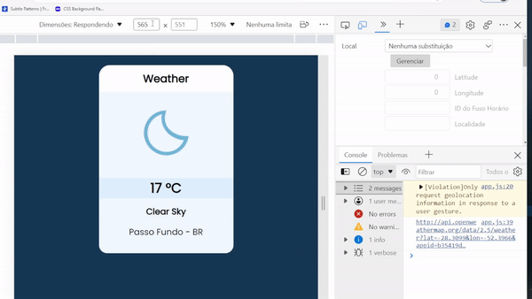

<h1>Weather App</h1>
<h1>:us:</h1>  Weather App made with vanilla JS that grabs the users' geolocation and displays current weather details. It also contains a Celsius to Fahrenheit converter.  
This was the first time I used an IPA in a project. Fortunately, it wasn't that complicated to understand :D  
I also removed the API key from the code. So if you want it to run you'll need to acces 'app.js line.16' and replace "API key" with a valid key.  
<em>I found this project on Youtube from Code Explained. The credit belongs to them, this was only made for practice purposes.</em>  

Code Explained repo : https://github.com/CodeExplainedRepo/Weather-App-JavaScript

The icons were made by Ashley Jager - https://github.com/manifestinteractive/weather-underground-icons

The API provider is http://www.OpenWeatherMap.org

<h1>&#x1f1e7;&#x1f1f7;</h1>
Aplicativo de clima feito com JS básico que utiliza a geolocalização do usuário para mostrar detalhes do clima atual. Também contém um conversor de celsius para Fahrenheit.  
  Essa foi a primeira vez que utilizei uma IPA em um projeto.  
  <em>Encontrei esse projeto no Youtube no canal Code Explained. O crédito pertence a eles, este projeto foi feito somente para praticar JS.</em>
